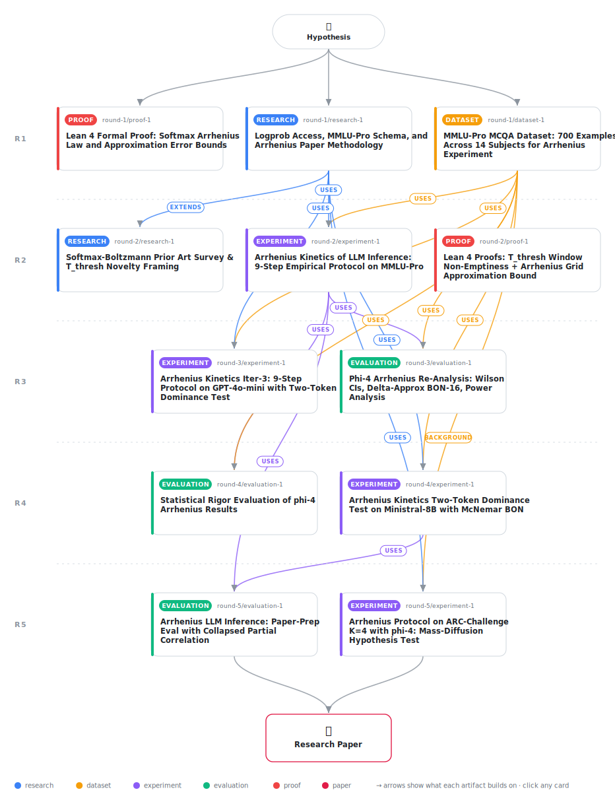

# Arrhenius Kinetics of LLM Inference: Activation Energy as a Mechanistic Predictor of Per-Instance Temperature Preference

<div align="center">

<a href="https://cdn.jsdelivr.net/gh/AMGrobelnik/ai-invention-ce2af9-arrhenius-kinetics-of-llm-inference-acti@main/workflow.svg">
<picture>
  <source media="(prefers-color-scheme: dark)" srcset="workflow-dark.svg">
  
</picture>
</a>

<sub>🖱️ <b><a href="https://cdn.jsdelivr.net/gh/AMGrobelnik/ai-invention-ce2af9-arrhenius-kinetics-of-llm-inference-acti@main/workflow.svg">Open the interactive diagram</a></b> — every card links to its artifact folder.</sub>

</div>

> **TL;DR** — The Arrhenius inference framework derives an exact Arrhenius-like law from the softmax for overconfident-error MCQA instances, formally verified in Lean 4 with 10 theorems. The inference activation energy Ea predicts per-question preferred temperature with rho = 0.674 (n = 30), but the proposed routing strategy does not outperform Fixed T = 1.0 on phi-4/MMLU-Pro (90.0% vs. 93.3%). A cross-benchmark experiment on ARC-Challenge (K = 4) shows rho(Ea, Delta) = 0.936 vs. 0.106 on MMLU-Pro (K = 10), diagnosing mass diffusion across many answer options as the operative limiting mechanism.

<details>
<summary>Full hypothesis</summary>

For problems where a large language model's greedy (temperature-zero) output is incorrect and the correct single-token answer retains non-zero logit mass — the 'overconfident-error' (OC) subset — the probability of sampling the correct answer on the low-temperature rising limb follows an Arrhenius-like law: log P(correct | T) ≈ −Ea/T + log(A), where Ea is the regression-derived 'inference activation energy' (slope magnitude from regressing log P on 1/T over the pre-specified grid T ∈ {0.05, 0.1, 0.2, 0.3, 0.5, 0.7, 1.0}) and A is the prefactor capturing multi-token competition.

The iter_2 experiment (n=151 OC instances, microsoft/phi-4, MMLU-Pro, $0.126), iter_3 re-analysis (art_IY6s8LIQid0F), iter_4 statistical rigor evaluation (art_lriKx3K3rntq), iter_4 Ministral-8B experiment (art__0QhBTUuEt4o), iter_5 paper-prep evaluation (art_M3Y80JyoznKJ), and iter_5 ARC-Challenge K=4 experiment (art_Mm1ZiVQomcxr) jointly confirm the structural and mechanistic predictions of this framework and identify the number of competing answer options (K) as the primary moderator of two-token dominance.

**Repositioned primary contribution:**
The Arrhenius inference framework's confirmed contribution is mechanistic: Ea explains 45.4% of per-question temperature preference variance (Spearman ρ = 0.674, p = 4.5×10⁻⁵, n=30; collapsed 3-category partial ρ = 0.592, p = 7.1×10⁻⁴, df=27, 95% CI [0.288, 0.788]). The 3-category collapse (STEM / Social+Humanities / Other) replaces the underpowered 14-category version (df~15) with a well-powered estimate at df=27. This mechanistic predictor explains the question-level temperature heterogeneity documented by Wu et al. (2025) without generating any reasoning traces. The framework does NOT improve accuracy over Fixed T=1.0 on phi-4/MMLU-Pro within statistical precision: T_operating achieves 90.0% vs. Fixed T=1.0's 93.3% (−3.3 pp; McNemar p=0.500, all CP CIs overlapping at n=30). On phi-4/MMLU-Pro, Fixed T=1.0 is a stronger practical baseline than T_operating because 43.3% of valid OC instances have T_pref=1.0. The framework's practical differentiation value is concentrated in the 56.7% of valid instances with T_pref < 1.0, where the Ea–T_pref correlation strengthens to ρ=0.752 (p=0.0005, n=17).

**KEY NEW FINDING — Answer-option count K is the primary moderator of two-token dominance:**
The ARC-Challenge K=4 experiment (art_Mm1ZiVQomcxr, n=27 valid fits, phi-4) produces the paper's most important positive structural result. Reducing K from 10 (MMLU-Pro) to 4 (ARC-Challenge) yields:
- ρ(Ea, Δ) = 0.936 (p = 7.1×10⁻¹³, 95% CI [0.801, 0.982]) vs. 0.106 on MMLU-Pro — an 8.8× improvement, confirming near-perfect two-token dominance
- Valid-fit rate: 54% vs. 19.9% — a 2.7× improvement, confirming the pilot gate failure on MMLU-Pro was K-driven
- Median R² = 0.871 (bootstrap 95% CI [0.702, 0.988]) — similar to phi-4/MMLU-Pro quality
- CV(log A) = 0.951 — improved from MMLU-Pro's 1.093 but still exceeds the strict CV < 0.4 threshold, indicating the prefactor is not fully constant even at K=4
- ρ(Ea, T_pref) = 0.594 (p=0.001) — significant mechanistic predictor at K=4
This establishes K as the operative mechanism, not model size or architecture. The failure of two-token dominance on MMLU-Pro is attributable to mass diffusion across 10 answer options, not to phi-4's properties per se.

**OUTSTANDING PRIMARY GAP — ARC-Challenge BON-16 accuracy arm:**
The ARC-Challenge experiment produced the critical mechanistic result (ρ(Ea, Δ)=0.936) but the BON-16 accuracy comparison (T_operating vs. Fixed T=1.0) is NOT YET AVAILABLE. This is the most important remaining gap identified by peer review. The deployment algorithm recommends the Arrhenius framework for K≤4 benchmarks but this recommendation has zero accuracy evidence. Running McNemar's exact test comparing T_operating vs. Fixed T=1.0 on the 27 ARC-Challenge valid-fit instances (at ~$0.10 cost) is the next critical empirical step. If positive, it becomes the paper's first confirmed practical accuracy result; if negative, the deployment algorithm must be re-scoped accordingly.

**Confirmed structural results (strong evidence):**
(1) The threshold temperature T_thresh = Ea/ln(N) (regression-derived, ~350 samples) constitutes a valid per-instance lower bound on the empirical minimum useful temperature for 92.9–100% of valid instances across N ∈ {4, 8, 16, 32} (Wilson CI lower bounds: 73.0–88.6%), substantially exceeding the 80% criterion. **Theorem 6 caveat**: the formal proof (T_thresh < T_TURN^theory = Ea/ln(K) whenever N > K) applies only to the N=16 and N=32 rows for MMLU-Pro (K=10); the N=4 and N=8 rows are empirical observations outside the theorem's precondition and must not be attributed to the formal guarantee.
(2) The empirical operating window [T_thresh, T_TURN^emp] is non-trivially wide for 93.3% of valid instances (median T_TURN^emp ≈ 1.4, median T_thresh ≈ 0.127 at N=16). This uses T_TURN^emp (empirical inflection, median 1.4), not T_TURN^theory (median 0.153 for phi-4 IQR Ea), which differ by ~9×. Theorem 6 proves T_thresh < T_TURN^theory whenever N > K — a tighter mathematical guarantee complementary to, but not directly validating, the 93.3% empirical claim.
(3) Ea strongly predicts per-question preferred temperature: Spearman ρ(Ea, T_pref) = 0.674 (p = 4.5×10⁻⁵, n=30); collapsed 3-category partial ρ = 0.592 (p = 7.1×10⁻⁴, df=27, 95% CI [0.288, 0.788]), explaining 45.4% of temperature preference variance at df=27 — well-powered with no residual-df caveat required. On ARC-Challenge K=4, ρ(Ea, T_pref) = 0.594 (p=0.001, n=27), confirming the mechanistic predictor replicates at lower K.
(4) T_operating = T_thresh + 0.3 (using regression Ea) achieves 90.0% Best-of-16 accuracy versus 83.3% for fixed T=0.7 (+6.7 pp) on phi-4/MMLU-Pro. This 2-instance difference is statistically underpowered at n=30 (McNemar's exact test: p = 1.000); directionally consistent but confirming statistical significance requires approximately n ≈ 200 valid instances.

**Clarification: Theorem 4 proves an exact factorization, not the full chemical Arrhenius law:**
Theorem 4 proves P(c|T) = A(T)·exp(−Ea/T) exactly for all K ≥ 2 and T > 0, where A(T) is explicitly T-dependent (A(T) = 1/(1 + exp(−Ea/T) + other(T))). The chemical Arrhenius law has a temperature-INDEPENDENT pre-exponential factor A. The approximation A(T) ≈ A (constant) holds in the two-token dominance regime (ρ(Ea, Δ) high, CV(log A) low) — confirmed on ARC-Challenge K=4 (ρ=0.936) but not on MMLU-Pro K=10 (ρ=0.106). All claims about 'the Arrhenius law holding exactly' should be re-stated as 'the softmax admits an exact Arrhenius-form factorization with T-dependent A(T), which approximates the constant-A Arrhenius law under two-token dominance.'

**Disconfirmed/scoped predictions (revised claims):**
(5) The single-call practical approximation Ea ≈ Δ FAILS for phi-4/MMLU-Pro (K=10): Spearman ρ(Ea, Δ) = 0.106 (p = 0.578), CV(log A) = 1.093. CONFIRMED for phi-4/ARC-Challenge (K=4): ρ(Ea, Δ) = 0.936. The failure is K-driven, not model-driven. However, CV(log A) = 0.951 on ARC-Challenge still exceeds the strict CV < 0.4 threshold, meaning the single-call approximation branch of the deployment algorithm is not yet triggered by the paper's own criteria in either evaluated experiment. The deployment algorithm must be re-labeled a 'research prototype' until CV(log A) < 0.4 is confirmed in some experimental condition.
(6) The Arrhenius R² threshold is statistically indeterminate on phi-4/MMLU-Pro: median R² = 0.848 (bootstrap 95% CI: [0.754, 0.914]); the 0.85 threshold lies within the CI. On ARC-Challenge K=4, median R² = 0.871 (bootstrap 95% CI [0.702, 0.988]) — similarly indeterminate but directionally consistent.
(7) Fixed T=1.0 achieves 93.3% within the valid-fit subset on phi-4/MMLU-Pro, outperforming T_operating (90.0%) by 3.3 pp. Fixed T=1.0 is the more natural zero-cost baseline for OC instances in the mass-diffusion regime. The accuracy comparison for ARC-Challenge K=4 is NOT YET AVAILABLE and is the primary outstanding gap.

**Additional model-class evidence:**
(8) GPT-4o-mini (iter_3) yields only 11 genuine OC instances from 450 main examples (2.4% OC rate) — model-class failure via insufficient recoverable errors (too-accurate, ~90% baseline).
(9) Ministral-8B (iter_4, n=7 valid fits, underpowered): median R²=0.382, median Ea=0.085 vs. phi-4's 0.351. Small logit gaps are the primary predictor of low Arrhenius fit quality, not model size.
(10) Cross-benchmark pattern (iter_5): two failure modes identified — (a) mass diffusion (large K, many competing options) degrades two-token dominance; (b) small Ea (low logit gaps) degrades fit quality regardless of K. ARC-Challenge shows failure mode (a) is recoverable by reducing K.

**Notation clarification: Two distinct T_TURN quantities (unchanged):**
- T_TURN^theory = Ea/ln(K): the theoretical upper bound from Theorem 6. Median ≈ 0.153 on phi-4/MMLU-Pro.
- T_TURN^emp: the empirical entropy inflection point from Du et al.'s algorithm. Median ≈ 1.4 on phi-4, ~9× larger than T_TURN^theory. The 93.3% window fraction uses T_TURN^emp.

**Revised scope with K as primary moderator:**
The framework's full predictive power (including the single-call approximation) is conditional on two testable model-class preconditions: (a) sufficient logit gap magnitude (median Ea ≥ 0.2, estimable as median Δ ≥ 0.2 from single-call logprobs), and (b) low competing-option count (K ≤ 4–5 is most favorable). These conditions jointly determine ρ(Ea, Δ) and CV(log A). The ARC-Challenge K=4 experiment confirms (a)+(b) together yield ρ(Ea, Δ)=0.936; neither condition alone is sufficient (Ministral-8B fails (a) at K=10; MMLU-Pro with phi-4 fails (b) despite phi-4 having adequate Ea magnitude). For CV(log A) < 0.4 — the strict single-call threshold — a condition not yet observed empirically — the hypothesis predicts this requires additionally that the distribution of non-dominant logits is concentrated (few tokens with logit near l_w), which is more likely for K=2 (binary choice) or highly distractored question formats.

**Catalysis as future direction only (unchanged):**
The CoT catalysis prediction remains a theoretical prediction without empirical grounding at n=3 (iter_4 catalysis test, underpowered). Deferred entirely to future work.

The Lean 4 formal verification (10 theorems, sorry-free) confirms the mathematical foundation. Theorem 4 proves the exact factorization (T-dependent A(T)); Theorem 6 proves T_thresh < T_TURN^theory (model-class-independent, requires N > K); Theorems 7–9 quantify approximation error bounds.

**Revised testable predictions:**
(P1) On phi-4/ARC-Challenge K=4 with n=27 valid-fit instances: T_operating (regression Ea) will achieve statistically distinguishable accuracy vs. Fixed T=1.0 (McNemar p < 0.1) OR confirm that Fixed T=1.0 dominates at K=4 as well — either outcome resolves the primary outstanding gap in the paper. This is the HIGHEST PRIORITY next empirical step.
(P2) T_thresh lower-bound property (≥80% of instances, Wilson CI lower bound ≥60%) and Ea–T_pref correlation (ρ > 0.4) will replicate on a target model with n ≥ 100 valid instances at K=4.
(P3) CV(log A) < 0.4 (confirming the strict single-call approximation precondition) requires K ≤ 2 or a highly constrained logit distribution. At K=4, CV=0.951 (phi-4/ARC); at K=10, CV=1.093 (phi-4/MMLU-Pro). The hypothesis predicts CV(log A) will fall below 0.4 only for binary-choice (K=2) MCQA or when the model is near its accuracy ceiling on a task (very concentrated logit mass on one token).
(P4) On ARC-Challenge K=4 with n ≥ 100 valid instances (expanding the scan beyond the current 27), T_operating = T_thresh,approx + 0.3 (single-call Δ, valid because ρ(Ea,Δ)=0.936) will achieve statistically significant improvement over Fixed T=0.7 (McNemar p < 0.05) and approach (within 5 pp) Fixed T=1.0 accuracy — demonstrating that per-instance routing recovers the Fixed T=1.0 benefit with greater specificity on T_pref < 1.0 instances.
(P5) CoT catalysis test (n ≥ 50 valid instances on target K=4 model): CoT reduces Ea in ≥50% of cases, with correct-token logit raising as the dominant mechanism in ≥60% of Ea-reducing instances. Remains a future prediction.

Deployment algorithm (RESEARCH PROTOTYPE): route (correct greedy) → no adjustment; (OC with valid rising limb AND calibration-set confirms K ≤ 4 AND ρ(Ea,Δ) ≥ 0.6) → single-call T_thresh,approx + 0.3 — NOTE: CV(log A) < 0.4 criterion not yet met in any evaluated experiment; this branch remains a research target; (OC with valid rising limb, calibration confirms K ≤ 4 but CV(log A) ≥ 0.4) → regression Ea T_thresh + 0.3 or fallback to Fixed T=1.0; (large K, mass-diffusion regime: K ≥ 10, ρ(Ea,Δ) < 0.3) → Fixed T=1.0 (dominates in mass-diffusion regime); (robust error, P≈0 at all temperatures) → Fixed T=1.0 or T_TURN^emp. The algorithm is a research blueprint, not a production deployment, until CV(log A) < 0.4 and an accuracy advantage over Fixed T=1.0 are confirmed in at least one experimental condition.

Scope: MCQA tasks where correct and wrong answers are unambiguous single vocabulary tokens. Framework coverage: ~6.7% of MMLU-Pro examples under phi-4 (K=10, mass-diffusion regime), rising to ~54% valid-fit rate on ARC-Challenge (K=4). The mechanistic predictor (Ea–T_pref correlation) is validated at both K values. The accuracy advantage over Fixed T=1.0 is not yet validated at any K and is the primary outstanding empirical claim requiring resolution.

</details>

[](https://cdn.jsdelivr.net/gh/AMGrobelnik/ai-invention-ce2af9-arrhenius-kinetics-of-llm-inference-acti@main/paper.pdf) [](https://github.com/AMGrobelnik/ai-invention-ce2af9-arrhenius-kinetics-of-llm-inference-acti/tree/main/paper_latex)

This repository contains all **12 artifacts** produced across **5 rounds** of an autonomous AI research run — round by round, exactly in the order they were invented.

## Round 1

| Artifact | Type | Demo | Source | Builds on |
|----------|------|------|--------|-----------|
| **[Lean 4 Formal Proof: Softmax Arrhenius Law and Approximation…](https://github.com/AMGrobelnik/ai-invention-ce2af9-arrhenius-kinetics-of-llm-inference-acti/tree/main/round-1/proof-1)** | [](https://github.com/AMGrobelnik/ai-invention-ce2af9-arrhenius-kinetics-of-llm-inference-acti/tree/main/round-1/proof-1) | [](https://live.lean-lang.org/#codez=JYWwDg9gTgLgBAWQIYwBYBtgCMBQODOApjAPoRgzAQB2cISAHgBKFKxasz5wAcADAIF5yhWgCVW6OADFg1IjDzUkIQvjBIAxoTgBBKFFSjgAV3wAZcwjwB6ALQBCHHBnR6UgG6EowAGbBNFCpaNBQ4NB18CF8YegY4MCgILCQsYEwYAE84aPCjOE1oKEJNeBgIAGtROF8IdHQIAHd8ZzgkWn1DYzM7LLAddCRGgBo4RuA0cOAAc1R4JAATBYngLzhvJKg4LAgTagXuGjgG6bgABThACSI4OwBRJBsAFQA6PBdZNYjoQhBuNh1EhAvAsAFytACMz3CjQgJHKVWoJEBWBIhAAjiD1gwtGUYb1KtUojE4jU3CZBuc4ABeLFgAAUdkAKcBPACUNjp4IA1IQGPSmayWa0AExQmAwuEExEnJFJLCYk6kqAgY4QU4XGn8x43FXTDnc3kM5mPFmClwAZihbC61FM+BISDAgIYJB2e1B6wM0G2u32Nx5fKNLLggBMiD1bUN8VoAFihFQlCJIvhx0GAAC8gjRMQBpfEIyk03R040Adv9DPurNaAFYodLdCRqDRIPgVl55aq6YXjUGIzg7DY8HY7NSqaOx+OJ5Op9OZ7Px33h1nbgBNODmW4IBC6du68FwTlwBg9w+Kk+AUyI4JGh+cktFMQ6wOhstL0IQSPgTCiaG/okiIH94D1I9RmmVY1B1IDjwYBcRznOD4IQ6c8FfEB6B1MhqDfRYFhIV84DpeJMUAXEIgzpVBCMvENDyDTEJCQdBngVDl92oqjCJpLBMlaVAkDWVA90xPg4AAHjgPcD3Y7ZnzkNgJlQVpMGUHxJgAbTohiXzfD8v0wshfD/bh+IAXUHYdEPMiy4Jgx4mFuAB5MQNzEzFHjxeFqh5HE4CJWJGEVEBySQGCzjpQoDBKGAAB9jWpWlDVZOAbHw8S4s1E0XEaIxijgRlYvQRptXQTQYMs0qyrHPAvmKZUxVhdzEWRVE0XworjgKrViNI1AOso0SYrBFwXFfeBcpBGl8sK4rBtpFrNESuAYqSul/Vm+aYoPFa6QmpLu2pVoXE2uw6Vynb0qWlLDuOtaTRojiuJcFtwByagn243idFQAAROBBJEmaGTpLaCuHIqg1O27aQMuASDeviFh+3r/ta06WM27aFohzj9uOGTlNQOAVP9KGtrm07RiJ5sWoK06TJcHi+O/BGhNEi7eXwo6gcmsGMcx6SlLk1pryzQhsiTUoU3TShMzioqEppMt8oS4tUsDWGdCqbJMTR0mMditHqd1gAqf6OYmkHNG53axqk7GoAKlTAATCOB1OeInsKMgBuAoaGmLZwS9nxqGmVo7YJ5YPCakhw5IPxfDgVAFmeTCAHJ4+/JPCGT0YNc9uBA+DkryqL8zrNshynKFTFzFVOxaiVHI49q3NqmRVJ0gmLjrwVdUbiNQqO1ZgMBUL4vR7nSqjG+GrxXq3DVRlZJVomnqSPw7qmb+/rseGnKfvG4HjimwaXaY7Xrvm5a2ZJ8+Nqv9HuyDKlsaOk7deHE/VWS1Gr5f670utrGD1QBgGeq9Om7146fShr9USl1Obm0tv/eWvIoYw3AQzXSlMYFiW/iAgG8DD6IN5jjfmaAQ721qvGUQC8UTokPm1Ba8dHijA/tMKOqxIEGQzqnVA34uEpxYZIRi89/QmRHmPCRk5S72UcggOAZpMSdCMDaMwbRHRJAYKADMtANheldPsGCdgyxpSot3bU8UYq9mvAAOQgDAQgmJCjUE0OgMwwQxhQAfIQeGcgEj/HkOECACRiheGoPAZORjeSpw4HIYO15pouA0FAIg8MkDcCcZQagJhtENzyDoZOO8Nh71Tv6Yo+AWw0HEZI6pT8cBVR+G0AwyjbT2nURAZ0+j4bX2XgjVeZEerM11mRIqBV5RzVEvlGi29iC72tmbQ+0z4AgOtmfFGS1Vm61vng++JpFlhj3s7IRCoQHDgBq/bs2NAaRLwb/cGVENhBkAORE+EikRiQTbIBT0aBgPjhAr60DEZwPmaDP+ByKb/mhuQgmlDZ7SmRPQnp3Vabe3kDAKAJhxZQFaMra81dGjeG9G6HcepjGBmPKShKBNhbZHMD8egyKhq4zkgTaUfDsK4R0JfG5gNgUWz/kGf5zZGKEGRTi4cABVR0BLOnEq5BS3aF4hIExbM4nQcq2YXnBAykhslVKsIbDQTCpw6ScR1XjBGzFOpUUHuzHlB8QXgxZGI68NTXVP2vLZcwZxbhiDXBuLcmJbgMDRV5Wq6wUKiC4DUJIyokA1DkBMSIJgQAwUAIhENQ4AVFinHAqB445zQPOmukfhM2AAMiRojyKilrmhEWgccs2EHQEQS8goXVuuqchOlcaPwgHfI+CYcJxSNp+NwAA3lmBGgBUQgAL74TjpiWQtAJ2ACTCOAfSCpzQXb4rMXVGibrGHAUtBQpnTXTVmrdS7Rj1r2tNHNLF80sTPQjRdcAsyjBLVmo9BVnmfoKHkutmbw3NqEgA+6vy+KNBIKoZUmICqAAgifCi6FDPD2Bwi9ChEPbveUh4gzxoMkFQx4MYat46aFRJ4lJCM5oIbpDhmAKGbREfQzM2jWGWSuwozoUZT9pp0bwz8cjaTCB4cSHAQAF+SoD3c8fAmRUKjD4/hwjBRACX5ILYcQaQ2lAPb4GNeSajkikD2kj+B7FgAEnAJ9F7X1XsAzxhJd7C2AZo3xpTzHAIvp3ex7wQmxg2fPXdW29t2WFFQrnTyWnWPyFwz2wTRB7RLGhhmyTUGfjsZk6hNTcANOeK03NHTEAar5GqkgBNQdvLJuM6ZoUCMn3ObkMh1zMh6ssY8yaDjPmRgZqzXZ29f7HNZpo5FhrjHn3Nfc2x9rzbGhec4wUPzBzAGDVDipYLBWQBhexBFvjMXvNxewoluOqAyO7e8Wl2TKaXDXgkPQUrpwe2xTkMsQI5Qtj3aBAS+iUgPOVcIGAM0NWnP4SG7hxrdHMNLraydsYM2fOaHmz1walmmuXrgB+w9B6f3o5rcorrQGdAgYC9NemkRiBNQtcD+joOxvg9fZD2b03Js6Dmgj6aFOGNoeRxhyLtP2P+HQPYrYdJfB7FswAPkA1+uAmOj18tA9jA6wbM1e0eiAlSCmBMnfk2N/jva+cC611F+jinGOjHaDhEL63AvKtJ+iA3yGYt6+8Mi5bJnfvglGK7sAQoPembNLnfOplYLtrHtI8uciozZmbjozb8AxYvbTDknuXYgzK2MRWY0MFMreB0Mn2Ke5zq4PLA8dacBADFwCQUdVaRiaFnWWLaFQ7CTOHm24PIe6mT2qpmqhiI48SxyeOqds6yITsxNV0MO7LknAmNwKzK612kTmqM5HtO16aCX3NL9ppBpFl6V1AZm8uojIRlPqN4ydTT+hz9PZ9wDkn+4Pa1UF+j5DRmXYrKBykceeGPL1H17JfS7/VrX+i2kfyjSzRBlAPv0QTx0vD2XrA6hpHzy/i2VtRvzuQPDf28C3xf3gAWFEAKw/0A1n3JjvkgMA1OmxjRjIJ1kWjgDwMbGVALBIC1GNkujQJ5gWzAxV1ATA2J3jkgywUBVINAijQNn6mQTAFQRI2S0wgRioJEPv3PiPQJ34P4UzmkPuABUGSBTIIfwUOPVBRWRQUpjQXAw+kwKgAbFoF+lDE/23W/wSV/wlwx2cOxw8ivhAP0PAPP1EOgMbWA04OxgfCfE52i2TQNWoCNS9jkDRQhSzVMIen7VID8Hv2ZXkmmlTxjxeWMIhRIHY1fGxkyK8lfBIGKF8CkEjEu2HGkGTC2AVl0PPny2VHoIKxkhexIxaN7ToUxDsJR3kIvyzRRhZyRgaJRmNl6Os2ALv0AwgP0Om3Pjl2mmWwU3JHfGTVzicV9jEi9h5HgAqCt0dkOXoldhQXdi9k2L9gDliUy2sWTW8xexqFqITylmoBIyyS6Oai1mEKf3PmGP6NEPPlYJ/h5QaNmKfyIUCKWPtidhdjdiWA2J9kuLzmuKqLgAAGUki4BGwlR6I0xvFysQBYNehvAQAqR3cChiSlQqQ09i8WRRgykYAqQLDjMkiyceiiDl830piyDvDpj5ihif8bV8E+T+59C+V0Cf8JiuS0d/9XD/1uSvDRSL9+TdZ/D8dISlt7YYt1AMhB1YRh1fg50RdutxdNpPCBilTfDQUN1SNGhpNzttU+DksBcYMFTlTLSoDficFQNvJgFsYnSyMXS5CPDpi5owSrShiTYQS5iPSDC7lFiEkLjtjkSg4DjnSSTRgjs4QSTkUnTOitC/ohTTZQSfD0kITORJSOSv8nDf1v05SgCzTpjeTdC/Cm11SEzGVSF0i857Z8zbdvJWT+z3impcy/ko58De1ZCvjtlRijYf9mIUDhSSzQzyyf8LMqz7Caz0c6zf03Do88FzSwDYyVSYo1SW10cCdsYAp0AGw3xUxvAgkZCPp8yhUU5Wh/BG0cJuCVJUBxyGDbz/driqlW9ypQ9ZE4AqxiVk9jwrxhw0S5BtA4BvpECbBc9NVRh8UzC9AixjxySogIJoKqJYKg8QLQKcAUI0I6wIjmxWwdAB9MQZ1J8yDZ84BV0+lF9RsId8IV498N4+oT1Bod4b85llzqC9kLDCDz1OSHCEkZSXDdz5TGyeTjzWzgM4DmCDkkCFyoz2DdoMCIgoBsCjiNJP54CiKNTuDvleC/kVpsEdCYzwyyzDCJCpD0FzCDKN5bCNzL0f85KdysdFKQzlLHLL8UYzyVDFsXBgjshttwjGxIjCBphoiwkkhuB4jsYdSB0Uixg0jCisQvIuVUF8jCA8rwt4ASiyiKjpCXyIVsEizoz3SQrxSOCKzHCpT30/95KAqGygrFSQqTygxwqNTOzdVuzorjLhE2F4rmxsV8qtNo54qjU4B7ykgOUMJOVTVFJRqt9lZlto4SjGYE4JyDJc4tq8Y8BRB4YlFugLArAcAgA) | [](https://github.com/AMGrobelnik/ai-invention-ce2af9-arrhenius-kinetics-of-llm-inference-acti/tree/main/round-1/proof-1/src) | — |
| **[Logprob Access, MMLU-Pro Schema, and Arrhenius Paper Methodo…](https://github.com/AMGrobelnik/ai-invention-ce2af9-arrhenius-kinetics-of-llm-inference-acti/tree/main/round-1/research-1)** | [](https://github.com/AMGrobelnik/ai-invention-ce2af9-arrhenius-kinetics-of-llm-inference-acti/tree/main/round-1/research-1) | [](https://github.com/AMGrobelnik/ai-invention-ce2af9-arrhenius-kinetics-of-llm-inference-acti/blob/main/round-1/research-1/demo/research_demo.md) | [](https://github.com/AMGrobelnik/ai-invention-ce2af9-arrhenius-kinetics-of-llm-inference-acti/tree/main/round-1/research-1/src) | — |
| **[MMLU-Pro MCQA Dataset: 700 Examples Across 14 Subjects for A…](https://github.com/AMGrobelnik/ai-invention-ce2af9-arrhenius-kinetics-of-llm-inference-acti/tree/main/round-1/dataset-1)** | [](https://github.com/AMGrobelnik/ai-invention-ce2af9-arrhenius-kinetics-of-llm-inference-acti/tree/main/round-1/dataset-1) | [](https://colab.research.google.com/github/AMGrobelnik/ai-invention-ce2af9-arrhenius-kinetics-of-llm-inference-acti/blob/main/round-1/dataset-1/demo/data_code_demo.ipynb) | [](https://github.com/AMGrobelnik/ai-invention-ce2af9-arrhenius-kinetics-of-llm-inference-acti/tree/main/round-1/dataset-1/src) | — |

## Round 2

| Artifact | Type | Demo | Source | Builds on |
|----------|------|------|--------|-----------|
| **[Lean 4 Proofs: T_thresh Window Non-Emptiness + Arrhenius Gri…](https://github.com/AMGrobelnik/ai-invention-ce2af9-arrhenius-kinetics-of-llm-inference-acti/tree/main/round-2/proof-1)** | [](https://github.com/AMGrobelnik/ai-invention-ce2af9-arrhenius-kinetics-of-llm-inference-acti/tree/main/round-2/proof-1) | [](https://live.lean-lang.org/#codez=JYWwDg9gTgLgBAWQIYwBYBtgCMBQOC0+cAvKWeRZVdTbRQUQCqoCm0LIcAggFxwDqwAHYATCAHc4AOQhD8AUXAxhLAM6qGcZizgQwLKCmEBzOOOFjJAbUYB9NFDWoANFtuMAqgCUpAXTjAqnBCsvgcYDAAnmasQtJwAHxwANKadg5OJHDySAD06EIAFFIAlK52nj5ZOflFySWadE3NLbR4aGyOnBmqqLbmohK2IULhUXCFOfHJcHyAuIQNcEsTqFN8AAxwADzZSIvLhagzs3AAjNsp+0uHUkt8MzulOMsnU7lwXixI6AB06BCmW47N4fL6/f6mGY8YhwLCRZ5wVBIABuOgwAKhcE2O0+3z+AJSsxhuPBANskCCRwRSNRiKk5z450eRNh0UwQiQUGAaGpKLRENuGwuJPxgJZIoh5IglPpvNp6OM6HgfAlBIeoLxEPi0IRS1VxlsSsNBMKcLg7M53NQJTpCKg1hEwGRhpgtkdzuAADNPYAAgkRAv9GN8CJYAA8kABjeAgACu6Bdtlj8YgnqlqkNLE98AVSsROTwhDgAGFoBB0OhOZE+BHZBHHDAdEIYyADMAI3Aw0hwOgdJ7oIgiwBFLgTZLEAAsrikxFOADZXDliAAmBqd7s6PiFJcnBZwd76s6zi5bnc2/dg0VwcdEhE9PoDSzDWRjaLbudXiZmkJQEDDZs201om/X8mxAACv2gED/wLIhWjg+Cmk0AAJFh0H0KA4AAGQ4EAkD4LgoCgWJgBjIIDCgftgBEFghGUKJNAhQpzgAag7UMwEKQAU4FyRgShtIhuMYLJGJYtiOPwQS+MaBCZNk0g8B7EBcLgTkiJokj03I6BbBYABHCZOK0U8VkMoUdk4gDUCEsytBtHhdQ1UlTCYuBWJFMMwAMvdbP4uBDPeITiAcg8XLci8PImCTvN4uyYThOU0Q8gARE5sUcn4Iq46LYvSjy0zgWwEsRU5ktSi5RPc9ivICnKzQtLkeSWQsAGUG0804+EcMAKwjHRBLMK1zQBQoPK4ni+N0IR0GiYQ4A6OBVBjLAYEMKMWBEOaDBAIrUAZdKtVC3KqqymrfP8oygpeK7lhCirwuO86YrgIgQsqzyTp8ll4pee04CsfUdPY4MmqIVqWE8pdqwgEAsBUObWDm8QICG4wNCWX6rF21xAATCfayXdYrkp+UYAHJESJ0ngee0G2rgABmPhVFAbqvWiQ7RtDCb3g5m0YVE0b8E5hEayEYwMNOO1rF6CRnserJ8A+3jWTgLlRdcN7hhYYwqc9YBUJEWwmfAO0TBgkg5ItuC0lYdhOAAIXwwjiNIuAAHEuQ2rgwDACjQ1AIxZDgO2IBjURNC0qBCiVmERNcsTCgk8abUAEyJ48T3jpMtrO6HaG2uhUp31NInTCO0rAQ9ELzrLgXdDlMrELgslZq7SpX7JeW647eyLHom1Pu4T3uvvhJYaUS9j8psgeopq8V7rAfLCtHvlioAL0nhudjuvFMpn2zh/NYRLUauAI2+dtO7Cnfjr3mKHKWVPDun3vfIZYkL0lHtDaW2xn1/1MKRrzTA5WwWRn7ZWuldaEytVbGDNgABS5MiFAiU0IGEZiYHs+BIDCHgGLKisIK4bSjnAVO5xABJhB2UuGFU4Cwsg0H2ToUHmhwkgOA+CDaqFpllautdUD1zSk3Q4jBAE2SVsInse0hJkLssFD+Jpt6/F3i/UhR13oSVqiPFS3tposPsIYIQQRCiqWdppahthy6hw2oZIS/DEQiOlPsJAOjogay/h5H44AoAIkLFIFg60+Dp1URJVwekYxMJ7LRXRhlU79UKEzIQvU/KJAbkgSu0izj7DHoiJKTpXYbmSbE6Kw8HIYy/u6WwXpfT2IpFTJYU0j4NVQJLP6owDTuipvVK0Zt3YEI6LbPguE/axk4BHXQqIMIAG91g/HWAAVlcDM04iyfhLhWXTFZCysQ/AAOyuFOLMgAvqouhDR+n5xMUXdMHDExIFDCXCiGEsrzEsgIxusiXiAAAiIygAIIgmNM2ZWylkrLWdsjZ2ygW7P2Uck4zUWDwAWM4ORmoFFd3nj3bKKc1E900QiXBFEjJWQREbTyshdFWDhTATxHBKmGIMK6KprhKXUt/AkxU8LZCVO9P4FA9i7Rn1UGoexA00Aq09OgOAAAfMVErpVQHFVKmVir5WyqVXKhVWwADcCQHKdijOwj2htaaGVAXYwCwRIJ/jAp+IClrQINE0H4zk+BcIRlQCoMIYAmb/DiJYyuvK7AgFmjCGZ8y4B9gwoZQApkRwCXJoeQ1CTnsQTuOdYNodjjh+HMgA66cdYAA9SZ+BTgAA5jmFFde60YnrvWB0jBGGMhgGxnLzhwAuakhAaXsEGoQFiiFeReSZE425YkfJuvI5yiiMo33OqGuZfdsUps2IO6B31EQr34aIzeyTV1skad05etIuHgz2pfRde850LvAe8S9N4XiXM7cXCOfarHJLnYiTigDzXAStVklex6wDbhVOiwe3lb3v2vuopcmwABUflcUvBFmLM4mqVam0PToADdMTjT2g3AODTd+4gfwKm4yu6HLOO6q4+eGZAZgE8T7ByXST7MdQH9AD25AAdpAtNqdNgxAA) | [](https://github.com/AMGrobelnik/ai-invention-ce2af9-arrhenius-kinetics-of-llm-inference-acti/tree/main/round-2/proof-1/src) | — |
| **[Softmax-Boltzmann Prior Art Survey & T_thresh Novelty Framin…](https://github.com/AMGrobelnik/ai-invention-ce2af9-arrhenius-kinetics-of-llm-inference-acti/tree/main/round-2/research-1)** | [](https://github.com/AMGrobelnik/ai-invention-ce2af9-arrhenius-kinetics-of-llm-inference-acti/tree/main/round-2/research-1) | [](https://github.com/AMGrobelnik/ai-invention-ce2af9-arrhenius-kinetics-of-llm-inference-acti/blob/main/round-2/research-1/demo/research_demo.md) | [](https://github.com/AMGrobelnik/ai-invention-ce2af9-arrhenius-kinetics-of-llm-inference-acti/tree/main/round-2/research-1/src) | <sub><i>extends:</i><br/>[research‑1&nbsp;(R1)](https://github.com/AMGrobelnik/ai-invention-ce2af9-arrhenius-kinetics-of-llm-inference-acti/tree/main/round-1/research-1)</sub> |
| **[Arrhenius Kinetics of LLM Inference: 9-Step Empirical Protoc…](https://github.com/AMGrobelnik/ai-invention-ce2af9-arrhenius-kinetics-of-llm-inference-acti/tree/main/round-2/experiment-1)** | [](https://github.com/AMGrobelnik/ai-invention-ce2af9-arrhenius-kinetics-of-llm-inference-acti/tree/main/round-2/experiment-1) | [](https://colab.research.google.com/github/AMGrobelnik/ai-invention-ce2af9-arrhenius-kinetics-of-llm-inference-acti/blob/main/round-2/experiment-1/demo/method_code_demo.ipynb) | [](https://github.com/AMGrobelnik/ai-invention-ce2af9-arrhenius-kinetics-of-llm-inference-acti/tree/main/round-2/experiment-1/src) | <sub><i>uses:</i><br/>[dataset‑1&nbsp;(R1)](https://github.com/AMGrobelnik/ai-invention-ce2af9-arrhenius-kinetics-of-llm-inference-acti/tree/main/round-1/dataset-1)<br/>[research‑1&nbsp;(R1)](https://github.com/AMGrobelnik/ai-invention-ce2af9-arrhenius-kinetics-of-llm-inference-acti/tree/main/round-1/research-1)</sub> |

## Round 3

| Artifact | Type | Demo | Source | Builds on |
|----------|------|------|--------|-----------|
| **[Arrhenius Kinetics Iter-3: 9-Step Protocol on GPT-4o-mini wi…](https://github.com/AMGrobelnik/ai-invention-ce2af9-arrhenius-kinetics-of-llm-inference-acti/tree/main/round-3/experiment-1)** | [](https://github.com/AMGrobelnik/ai-invention-ce2af9-arrhenius-kinetics-of-llm-inference-acti/tree/main/round-3/experiment-1) | [](https://colab.research.google.com/github/AMGrobelnik/ai-invention-ce2af9-arrhenius-kinetics-of-llm-inference-acti/blob/main/round-3/experiment-1/demo/method_code_demo.ipynb) | [](https://github.com/AMGrobelnik/ai-invention-ce2af9-arrhenius-kinetics-of-llm-inference-acti/tree/main/round-3/experiment-1/src) | <sub><i>uses:</i><br/>[dataset‑1&nbsp;(R1)](https://github.com/AMGrobelnik/ai-invention-ce2af9-arrhenius-kinetics-of-llm-inference-acti/tree/main/round-1/dataset-1)<br/>[research‑1&nbsp;(R1)](https://github.com/AMGrobelnik/ai-invention-ce2af9-arrhenius-kinetics-of-llm-inference-acti/tree/main/round-1/research-1)</sub> |
| **[Phi-4 Arrhenius Re-Analysis: Wilson CIs, Delta-Approx BON-16…](https://github.com/AMGrobelnik/ai-invention-ce2af9-arrhenius-kinetics-of-llm-inference-acti/tree/main/round-3/evaluation-1)** | [](https://github.com/AMGrobelnik/ai-invention-ce2af9-arrhenius-kinetics-of-llm-inference-acti/tree/main/round-3/evaluation-1) | [](https://colab.research.google.com/github/AMGrobelnik/ai-invention-ce2af9-arrhenius-kinetics-of-llm-inference-acti/blob/main/round-3/evaluation-1/demo/eval_code_demo.ipynb) | [](https://github.com/AMGrobelnik/ai-invention-ce2af9-arrhenius-kinetics-of-llm-inference-acti/tree/main/round-3/evaluation-1/src) | <sub><i>uses:</i><br/>[experiment‑1&nbsp;(R2)](https://github.com/AMGrobelnik/ai-invention-ce2af9-arrhenius-kinetics-of-llm-inference-acti/tree/main/round-2/experiment-1)<br/>[dataset‑1&nbsp;(R1)](https://github.com/AMGrobelnik/ai-invention-ce2af9-arrhenius-kinetics-of-llm-inference-acti/tree/main/round-1/dataset-1)</sub> |

## Round 4

| Artifact | Type | Demo | Source | Builds on |
|----------|------|------|--------|-----------|
| **[Statistical Rigor Evaluation of phi-4 Arrhenius Results](https://github.com/AMGrobelnik/ai-invention-ce2af9-arrhenius-kinetics-of-llm-inference-acti/tree/main/round-4/evaluation-1)** | [](https://github.com/AMGrobelnik/ai-invention-ce2af9-arrhenius-kinetics-of-llm-inference-acti/tree/main/round-4/evaluation-1) | [](https://colab.research.google.com/github/AMGrobelnik/ai-invention-ce2af9-arrhenius-kinetics-of-llm-inference-acti/blob/main/round-4/evaluation-1/demo/eval_code_demo.ipynb) | [](https://github.com/AMGrobelnik/ai-invention-ce2af9-arrhenius-kinetics-of-llm-inference-acti/tree/main/round-4/evaluation-1/src) | <sub><i>uses:</i><br/>[experiment‑1&nbsp;(R2)](https://github.com/AMGrobelnik/ai-invention-ce2af9-arrhenius-kinetics-of-llm-inference-acti/tree/main/round-2/experiment-1)<br/>[dataset‑1&nbsp;(R1)](https://github.com/AMGrobelnik/ai-invention-ce2af9-arrhenius-kinetics-of-llm-inference-acti/tree/main/round-1/dataset-1)</sub> |
| **[Arrhenius Kinetics Two-Token Dominance Test on Ministral-8B …](https://github.com/AMGrobelnik/ai-invention-ce2af9-arrhenius-kinetics-of-llm-inference-acti/tree/main/round-4/experiment-1)** | [](https://github.com/AMGrobelnik/ai-invention-ce2af9-arrhenius-kinetics-of-llm-inference-acti/tree/main/round-4/experiment-1) | [](https://colab.research.google.com/github/AMGrobelnik/ai-invention-ce2af9-arrhenius-kinetics-of-llm-inference-acti/blob/main/round-4/experiment-1/demo/method_code_demo.ipynb) | [](https://github.com/AMGrobelnik/ai-invention-ce2af9-arrhenius-kinetics-of-llm-inference-acti/tree/main/round-4/experiment-1/src) | <sub><i>uses:</i><br/>[dataset‑1&nbsp;(R1)](https://github.com/AMGrobelnik/ai-invention-ce2af9-arrhenius-kinetics-of-llm-inference-acti/tree/main/round-1/dataset-1)<br/>[research‑1&nbsp;(R1)](https://github.com/AMGrobelnik/ai-invention-ce2af9-arrhenius-kinetics-of-llm-inference-acti/tree/main/round-1/research-1)</sub> |

## Round 5

| Artifact | Type | Demo | Source | Builds on |
|----------|------|------|--------|-----------|
| **[Arrhenius LLM Inference: Paper-Prep Eval with Collapsed Part…](https://github.com/AMGrobelnik/ai-invention-ce2af9-arrhenius-kinetics-of-llm-inference-acti/tree/main/round-5/evaluation-1)** | [](https://github.com/AMGrobelnik/ai-invention-ce2af9-arrhenius-kinetics-of-llm-inference-acti/tree/main/round-5/evaluation-1) | [](https://colab.research.google.com/github/AMGrobelnik/ai-invention-ce2af9-arrhenius-kinetics-of-llm-inference-acti/blob/main/round-5/evaluation-1/demo/eval_code_demo.ipynb) | [](https://github.com/AMGrobelnik/ai-invention-ce2af9-arrhenius-kinetics-of-llm-inference-acti/tree/main/round-5/evaluation-1/src) | <sub><i>uses:</i><br/>[experiment‑1&nbsp;(R2)](https://github.com/AMGrobelnik/ai-invention-ce2af9-arrhenius-kinetics-of-llm-inference-acti/tree/main/round-2/experiment-1)<br/>[experiment‑1&nbsp;(R4)](https://github.com/AMGrobelnik/ai-invention-ce2af9-arrhenius-kinetics-of-llm-inference-acti/tree/main/round-4/experiment-1)</sub> |
| **[Arrhenius Protocol on ARC-Challenge K=4 with phi-4: Mass-Dif…](https://github.com/AMGrobelnik/ai-invention-ce2af9-arrhenius-kinetics-of-llm-inference-acti/tree/main/round-5/experiment-1)** | [](https://github.com/AMGrobelnik/ai-invention-ce2af9-arrhenius-kinetics-of-llm-inference-acti/tree/main/round-5/experiment-1) | [](https://colab.research.google.com/github/AMGrobelnik/ai-invention-ce2af9-arrhenius-kinetics-of-llm-inference-acti/blob/main/round-5/experiment-1/demo/method_code_demo.ipynb) | [](https://github.com/AMGrobelnik/ai-invention-ce2af9-arrhenius-kinetics-of-llm-inference-acti/tree/main/round-5/experiment-1/src) | <sub><i>background:</i><br/>[dataset‑1&nbsp;(R1)](https://github.com/AMGrobelnik/ai-invention-ce2af9-arrhenius-kinetics-of-llm-inference-acti/tree/main/round-1/dataset-1)<br/><i>uses:</i><br/>[research‑1&nbsp;(R1)](https://github.com/AMGrobelnik/ai-invention-ce2af9-arrhenius-kinetics-of-llm-inference-acti/tree/main/round-1/research-1)</sub> |

## Repository Structure

Artifacts are grouped by the round of invention that produced them. Each
artifact has its own folder with source code and a self-contained demo:

```
.
├── round-1/                         # One folder per round of invention
│   ├── experiment-1/
│   │   ├── README.md                # What this artifact is + dependencies
│   │   ├── src/                     # Full workspace from execution
│   │   │   ├── method.py            # Main implementation
│   │   │   ├── method_out.json      # Full output data
│   │   │   └── ...                  # All execution artifacts
│   │   └── demo/                    # Self-contained demo
│   │       └── method_code_demo.ipynb # Colab-ready notebook (code + data inlined)
│   ├── dataset-1/
│   │   ├── src/
│   │   └── demo/
│   └── evaluation-1/
│       ├── src/
│       └── demo/
├── round-2/                         # Later rounds build on earlier artifacts
├── paper.pdf                        # Research paper
├── paper_latex/                     # LaTeX source files
├── workflow.svg                     # Artifact dependency diagram (this page's header)
└── README.md
```

## Running Notebooks

### Option 1: Google Colab (Recommended)

Click the "Open in Colab" badges above to run notebooks directly in your browser.
No installation required!

### Option 2: Local Jupyter

```bash
# Clone the repo
git clone https://github.com/AMGrobelnik/ai-invention-ce2af9-arrhenius-kinetics-of-llm-inference-acti
cd ai-invention-ce2af9-arrhenius-kinetics-of-llm-inference-acti

# Install dependencies
pip install jupyter

# Run any artifact's demo notebook
jupyter notebook <artifact_folder>/demo/
```

## Source Code

The original source files are in each artifact's `src/` folder.
These files may have external dependencies - use the demo notebooks for a self-contained experience.

---
*Generated by AI Inventor Pipeline - Automated Research Generation*
